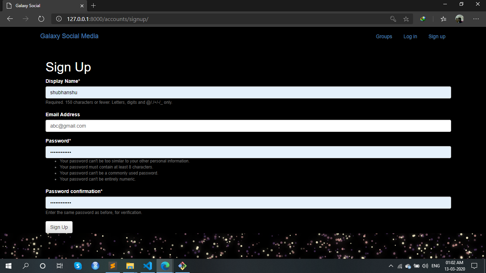

# Galaxy Social Media Website made with ❤ by Shubhanshu using Django Framework
- **A Social Outer Space Fan Community site.**

## Description
 - **Users can create groups on various topics (e.g. SpaceX, NASA, Pluto, etc...)**
 - **They can then create posts in the groups.**
 - **They can also leave and join other groups.**
 - **It has a few key features:**
    - Groups (similar to subreddits).
    - Multiple Users and Authorizations.
    - Posts in groups (similar to a tweet).
    - Linking user profiles with @ symbol.
    - Multiple applications.
 
 
#### To Run the App
```bash
python manage.py runserver
```
#### Screenshots of the Website





