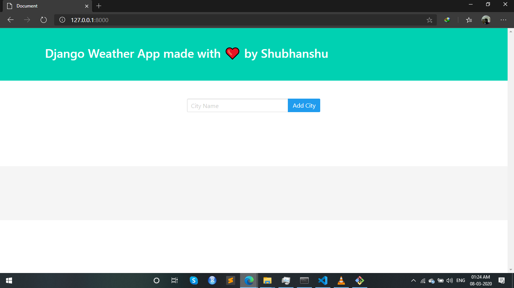
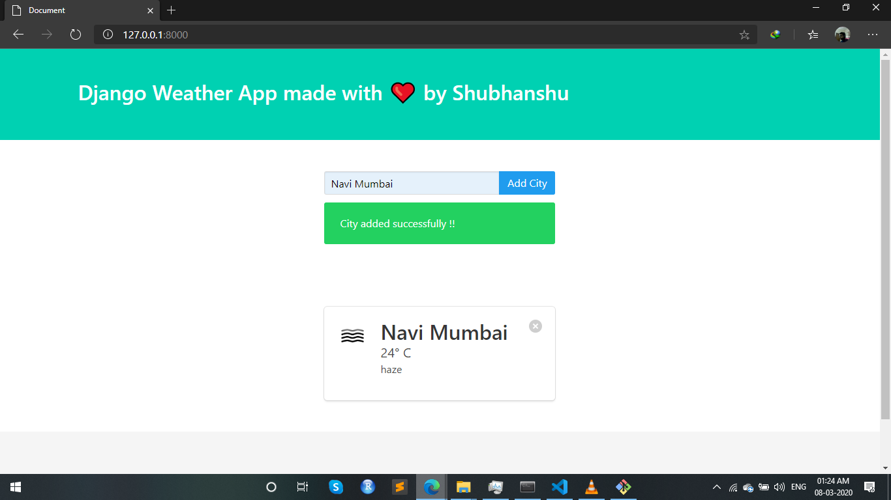
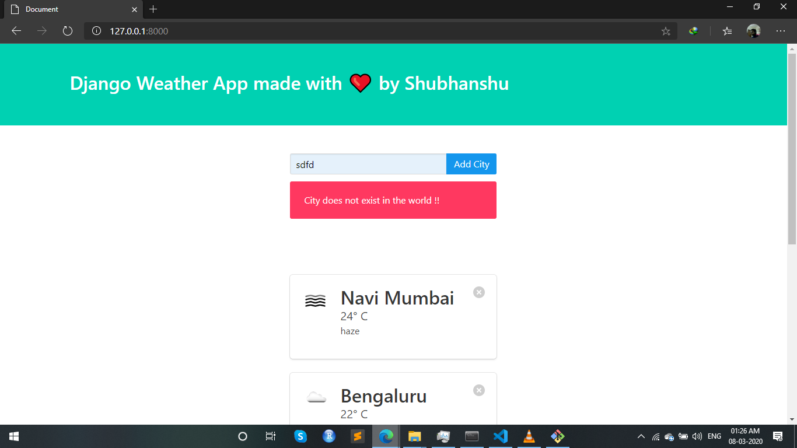

### Weather App made with ❤ by Shubhanshu using Django Framework
- Current weather and forecasts in your city

#### Description
 - A weather app built with Django Framework using OpenWeatherMap API ( https://openweathermap.org/ )
 
#### To Run the App
```bash
python manage.py runserver
```
#### Screenshots of the App









